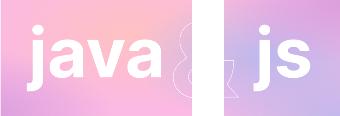

<h1 align="center">Hi 👋, I'm Przemek</h1>
<h4 align="center">I'm a freelancer specializing in the java/web development and graphic/motion design. Currently working on basketball website!</h4>

Graduate of IT Technician School | Semi-finalist of <a href="https://www.mistrzostwait.com/">Mistrzostwa IT Championship</a></i>

  
  

 
 
 
 
 

I’m a young individual with a passion for basketball (drives me to continuously improve my skills even ones not related with basketball). I have completed technical education in information technology. I possess a keen interest in programming languages such as Java and JavaScript, as well as networking and Server management, I also have a flair for graphics and video editing. I’m a motivated and ambitious individual who seeks to leverage my interests, well-equipped to contribute to projects that require a combination of technical expertise and creative thinking. Additionally, open to remote work with own equipment.

